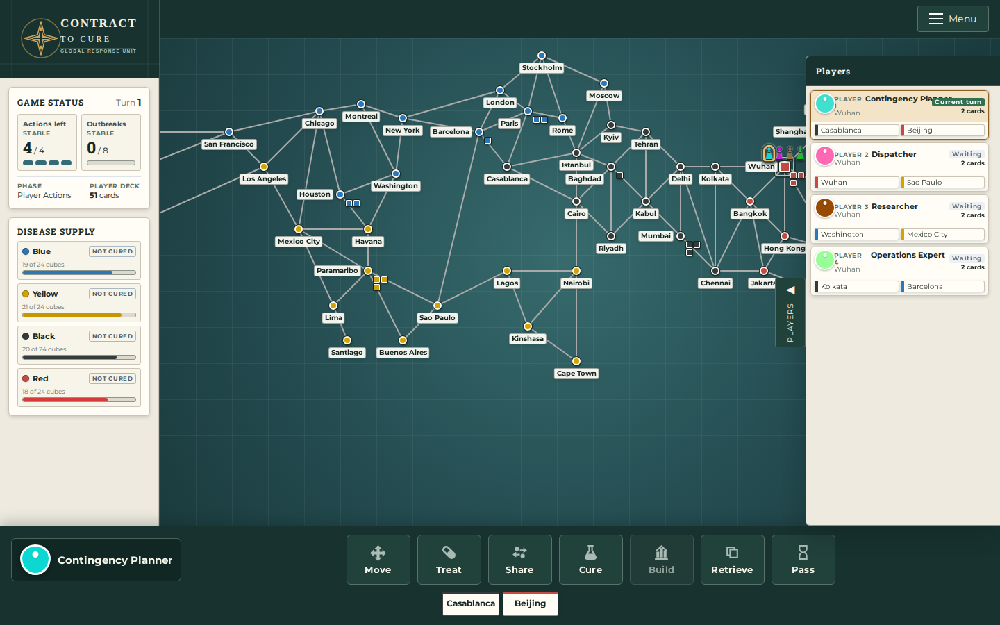
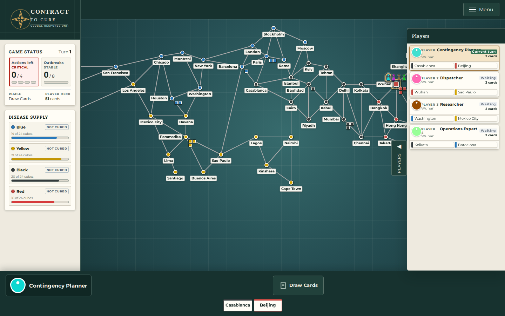
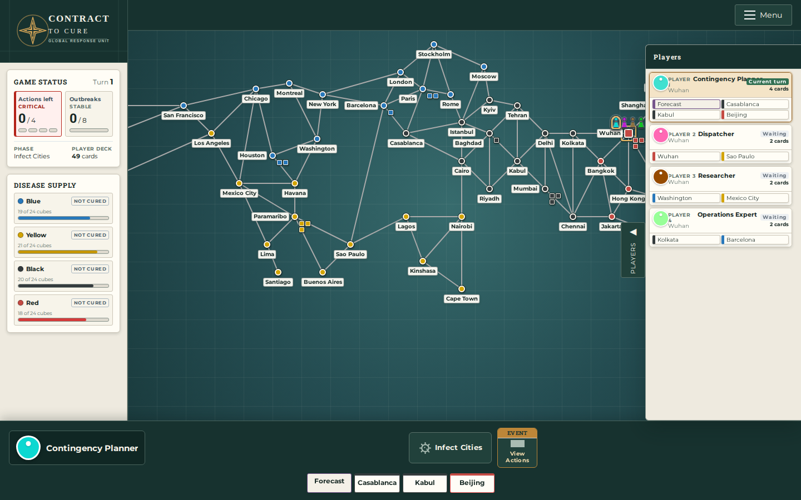

# Contract to Cure visual system

Contract to Cure uses a **field laboratory** visual language: expedition-map
materials and practical scientific instruments, expressed with warm paper
surfaces, mineral-green chrome, ink typography, technical grid lines, and a
single brass interaction accent.

The implementation lives in `public/css/theme.css`. It is loaded after the
legacy component modules so the shared tokens form the authoritative visual
layer without changing component layout or game behavior.

## Rules

- Disease blue, yellow, black, and red identify disease cities, cubes, supply
  meters, and city cards. They are not general interface decoration.
- Brass identifies focus and the active tool. Green, amber, red, and blue are
  reserved for success, warning, danger, and information states.
- Raised content uses paper surfaces, a one-pixel border, a small radius, and
  one of two shared elevations.
- Actions use one-color technical icons. This avoids platform-specific emoji
  rendering and keeps every tool visually related.
- All interactive controls share the brass focus ring. Motion collapses when
  the operating system requests reduced motion.
- Player and infection cards share a paper-card structure with visible type,
  identity, and family labels. Disease accents reinforce those labels rather
  than replacing them; selected and unavailable cards use shape, pattern, and
  text-compatible states in addition to color.
- The active hand stays inside a compact, horizontally scrollable tray. Cards
  expand within the tray on hover, keyboard focus, or tap, keeping both the map
  and the action controls unobstructed.

## Reference views

These references were captured from the running application at a 1440×900
viewport. Together they cover the three primary turn phases and their distinct
action-bar states.

### Player actions

### Draw cards

### Infect cities

